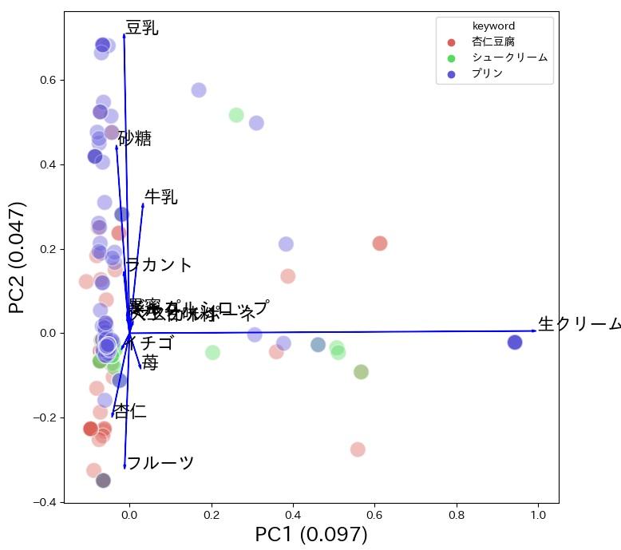

# Spacy Ginza による固有表現の自動認識
Spacy + Ginzaを使えば、カスタム辞書を手作業で作成せずにある程度は特定の属性の語彙だけを抽出できる

1. Spacyには様々なバージョン、辞書がある。それらによって固有表現ラベルの種類や精度が異なる。これらの違いは
[こちら](https://zenn.dev/akimen/articles/8d818ca704f079
)が詳しい。今回は、ja_ginzaを使う。準備として、以下を入力すること。 
pip install spacy  
pip install ja_ginza  
2. まずは、簡単な文書をSpacyで解析する。[named_entity.py](named_entity.py)を実行すると、シュー/プリン/杏仁豆腐 のツクレポを読み込んで、語彙と固有表現を表示する。
```python
    name_entity = {}
    for text in tsukurepo_texts:#ツクレポを1行づつ読む
        doc = nlp(text)# 形態素解析+固有表現認識    
        for ent in doc.ents:# .ents で文書の語彙と属性の集合を取り出す
            if ent.text not in name_entity:
                # .text:語彙（フレーズ認識する） .label_ : 固有表現
                name_entity[ent.text]=ent.label_
                print(ent.text,ent.label_)

```

3. BoWを作成する今までのプログラム[tsukurepo_bow_vectorizer.py](tsukurepo_bow_vectorizer.py)で、MeCabの代わりにSpacyを使って、形態素解析と同時に料理関連の固有表現ラベル["Food_Other","Flora_Part","Compound","Drug","Flora"]の語彙だけを取り出して、BoWを作成する。
[tokenizer_spacy.py](tokenizer_spacy.py)
### 演習1
tsukurepo_bow_vectorizer.pyでは、Bowを作成するにあたって、tokenizer_customDic.pyを呼び出して形態素解析している。これをtokenizer_spacy.pyを呼び出して形態素解析（固有表現抽出）しするように修正せよ。（実行に時間がかかるので正常に動作したら中断してよい）
### 演習2
[tsukurepo_bow_named_entity.csv](./data/tsukurepo_bow_named_entity.csv)を読み込んで主成分分析するように[tsukurepo_pca.py](tsukurepo_pca.py)を修正せよ。（以下のような主成分平面になるはず）


```python
def tokenize(txt):
    nlp = spacy.load("ja_ginza")
    
    filter_words =["Food_Other","Flora_Part","Compound","Drug","Flora"]
    
    doc = nlp(txt)
    words =[]
    for ent in doc.ents:
        # 固有表現がfilter_wordsに該当する場合のみ語彙を抽出する
        if ent.label_ in filter_words:
            words.append(ent.text)
            print(ent.text)
    return words
```